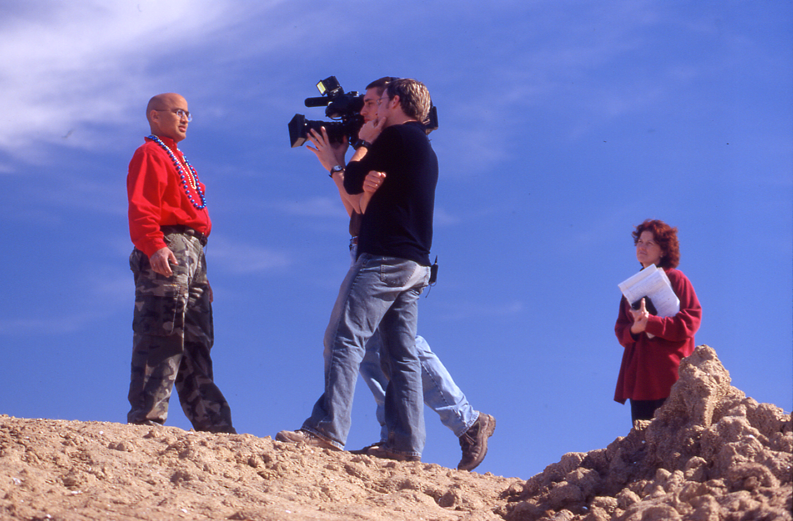
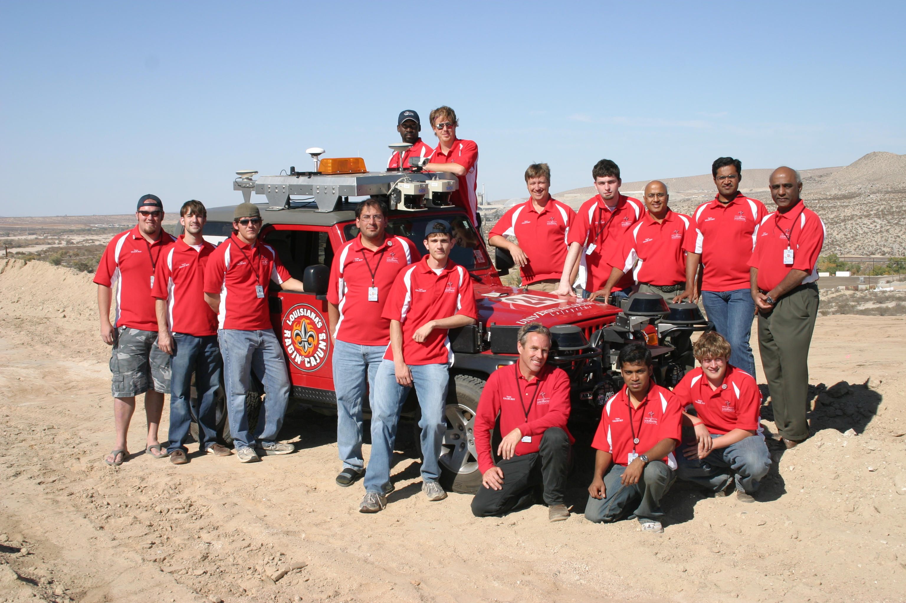
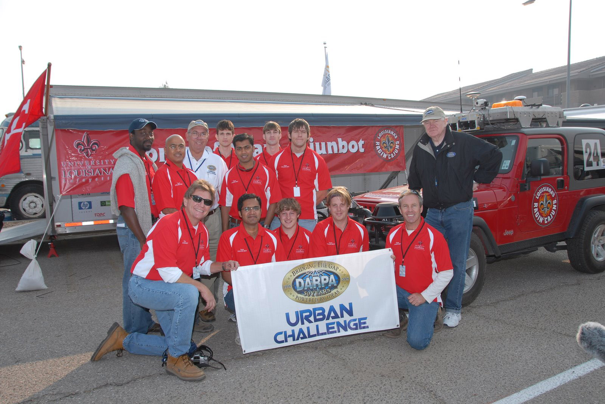

# CajunBot Media

Press releases and photos related to CajunBot.

- [2004_spring_la_louisiane_full.pdf](2004_spring_la_louisiane_full.pdf)
- [2004_spring_la_louisiane_research_cajunbot.pdf](2004_spring_la_louisiane_research_cajunbot.pdf)
- [2005_fall_la_louisiane_research_cajunbot.pdf](2005_fall_la_louisiane_research_cajunbot.pdf)
- [archive.darpa.mil_grandchallenge_docs_PR_Track_B_updated_12_06.pdf](archive.darpa.mil_grandchallenge_docs_PR_Track_B_updated_12_06.pdf)
- [archive.darpa.mil_grandchallenge_docs_PR_UC_Site_Visit_Announcement.pdf](archive.darpa.mil_grandchallenge_docs_PR_UC_Site_Visit_Announcement.pdf)
- [archive.darpa.mil_grandchallenge_docs_UC_Semifinalist_Location_Release080807.pdf](archive.darpa.mil_grandchallenge_docs_UC_Semifinalist_Location_Release080807.pdf)
- [CajunBot - Wikipedia, the free encyclopedia.pdf](CajunBot%20-%20Wikipedia%2C%20the%20free%20encyclopedia.pdf)
- [CajunbotDay.pdf](CajunbotDay.pdf)
- [DARPA Grand Challenge - Wikipedia, the free encyclopedia.pdf](DARPA%20Grand%20Challenge%20-%20Wikipedia%2C%20the%20free%20encyclopedia.pdf)
- [DARPA UC Home.pdf](DARPA%20UC%20Home.pdf)
- [DARPA UC Overview.pdf](DARPA%20UC%20Overview.pdf)
- [DARPA UC Team Information.pdf](DARPA%20UC%20Team%20Information.pdf)
- [PR_UC_Site_Visit_Announcement.pdf](PR_UC_Site_Visit_Announcement.pdf)
- [UL Lafayette_ Public Relations_ News Release_ 2004_ #051.pdf](UL%20Lafayette_%20Public%20Relations_%20News%20Release_%202004_%20%23051.pdf)
- [UL Lafayette_ Public Relations_ News Release_ 2004_ #078.pdf](UL%20Lafayette_%20Public%20Relations_%20News%20Release_%202004_%20%23078.pdf)
- [UL Lafayette_ Public Relations_ News Release_ 2004_ #203.pdf](UL%20Lafayette_%20Public%20Relations_%20News%20Release_%202004_%20%23203.pdf)
- [UL Lafayette_ Public Relations_ News Release_ 2007_ #865.pdf](UL%20Lafayette_%20Public%20Relations_%20News%20Release_%202007_%20%23865.pdf)
- [UL Lafayette_ Public Relations_ News Release_ 2008_ #229.pdf](UL%20Lafayette_%20Public%20Relations_%20News%20Release_%202008_%20%23229.pdf)
- [UL Lafayette_ Public Relations_ News Release_ 2008_ #240.pdf](UL%20Lafayette_%20Public%20Relations_%20News%20Release_%202008_%20%23240.pdf)
- [UrbanChallengeTeamMap_110107.pdf](UrbanChallengeTeamMap_110107.pdf)
- [Science Speaker Series _ Louisiana School for Math, Science, & the Arts.pdf](Science%20Speaker%20Series%20_%20Louisiana%20School%20for%20Math%2C%20Science%2C%20%26%20the%20Arts.pdf)
